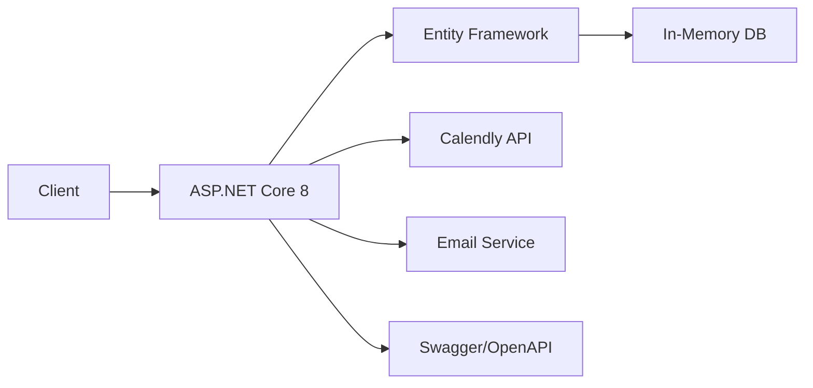

<div align="center">

# ✂️ Elite Barber - Premium Randevu Sistemi

[](https://dotnet.microsoft.com/)
[](https://docs.microsoft.com/en-us/dotnet/csharp/)
[](https://opensource.org/licenses/MIT)
[](http://makeapullrequest.com)
[](https://barber-f934.onrender.com)
[](https://github.com/CemRoot/BarberDemo)

**🏆 Lüks berber deneyimi için tasarlanmış modern, enterprise-grade randevu yönetim platformu**

[🌐 Canlı Demo](https://barber-f934.onrender.com) •
[📅 Calendly](https://calendly.com/isgelistirme41/30min) •
[📚 API Docs](https://barber-f934.onrender.com/swagger) •
[🐛 Issues](https://github.com/CemRoot/BarberDemo/issues) •
[💬 Discussions](https://github.com/CemRoot/BarberDemo/discussions)

---

### ⭐ Bu projeyi beğendiyseniz yıldız vermeyi unutmayın!

[](https://github.com/CemRoot/BarberDemo/stargazers)
[](https://github.com/CemRoot/BarberDemo/network/members)
[](https://github.com/CemRoot/BarberDemo/watchers)

</div>

---

## 📋 İçindekiler

- [🎯 Proje Hakkında](#-proje-hakkında)
- [✨ Özellikler](#-özellikler)
- [🛠️ Teknoloji Stack](#️-teknoloji-stack)
- [📦 Gereksinimler](#-gereksinimler)
- [🚀 Hızlı Başlangıç](#-hızlı-başlangıç)
  - [Local Development](#local-development)
  - [Docker ile Çalıştırma](#docker-ile-çalıştırma)
- [📁 Proje Yapısı](#-proje-yapısı)
- [🔧 Yapılandırma](#-yapılandırma)
- [🌐 Deployment](#-deployment)
- [📖 API Dokümantasyonu](#-api-dokümantasyonu)
- [🎨 Özelleştirme](#-özelleştirme)
- [🧪 Testing](#-testing)
- [🔒 Güvenlik](#-güvenlik)
- [🤝 Katkıda Bulunma](#-katkıda-bulunma)
- [📄 Lisans](#-lisans)
- [👥 Katkıda Bulunanlar](#-katkıda-bulunanlar)
- [📞 İletişim & Destek](#-iletişim--destek)
- [🙏 Teşekkürler](#-teşekkürler)
- [📈 Yol Haritası](#-yol-haritası)

---

## 🎯 Proje Hakkında

**Elite Barber**, modern berber salonları için geliştirilmiş, production-ready bir randevu yönetim sistemidir. ASP.NET Core 8 ile inşa edilmiş bu platform, müşterilerinize sorunsuz bir randevu deneyimi sunarken, işletmenize profesyonel bir dijital varlık kazandırır.

### 🌟 Neden Elite Barber?

- ✅ **Kolay Kurulum** - 5 dakikada çalıştırın
- ✅ **Modern Teknolojiler** - .NET 8, Bootstrap 5, Calendly API
- ✅ **Responsive Tasarım** - Mobil, tablet ve desktop desteği
- ✅ **Production Ready** - Docker, CI/CD hazır
- ✅ **Açık Kaynak** - MIT lisansı ile özgürce kullanın
- ✅ **Kolay Özelleştirme** - Renk, logo, içerik kolayca değiştirilebilir

### 🎬 Demo Video

> 📹 Yakında eklenecek - Projenin çalışır halini gösteren video

---

## ✨ Özellikler

### 🎪 **Çift Katmanlı Randevu Sistemi**

| Özellik | Açıklama |
|---------|----------|
| 🔥 **Calendly Entegrasyonu** | Dünya standartlarında profesyonel randevu yönetimi |
| ⚡ **Hızlı Form Sistemi** | Anlık randevu alımı için optimize edilmiş UX |
| 🔄 **Esnek Seçenekler** | Kullanıcılara çoklu randevu alma yöntemi |
| 📱 **Responsive UI** | Mobil, tablet ve desktop'ta kusursuz görünüm |

### 💈 **Premium Berber Özellikleri**

- **🎨 Görsel Galeri** - Profesyonel kesimlerinizi sergileyin
- **👥 Ekip Tanıtımı** - Uzman berberlerinizi müşterilerinize tanıtın
- **💎 Hizmet Kataloğu** - Detaylı hizmet açıklamaları ve fiyatlandırma
- **⭐ Müşteri Yorumları** - Sosyal kanıt ile güven oluşturma
- **📍 Konum & İletişim** - Google Maps entegrasyonu (yakında)
- **🕐 Çalışma Saatleri** - Otomatik saat kontrolü

### 🛠️ **Teknik Özellikler**



---

## 🛠️ Teknoloji Stack

### Backend

| Teknoloji | Versiyon | Açıklama |
|-----------|----------|----------|
|  | 8.0 | Modern web framework |
|  | 12.0 | Programming language |
|  | 8.0 | ORM ve database yönetimi |

### Frontend

| Teknoloji | Versiyon | Açıklama |
|-----------|----------|----------|
|  | 5 | Markup language |
|  | 3 | Styling |
|  | ES6+ | Client-side scripting |
|  | 5.3 | UI framework |
|  | 6.0 | Icon library |

### DevOps & Tools

| Teknoloji | Açıklama |
|-----------|----------|
|  | Containerization |
|  | CI/CD (yakında) |
|  | API documentation |

### External Services

- **Calendly API** - Professional appointment scheduling
- **SMTP** - Email notifications
- **Render/Railway** - Cloud hosting

---

## 📦 Gereksinimler

### Minimum Gereksinimler

| Bileşen | Versiyon | İndirme Linki |
|---------|----------|---------------|
| .NET SDK | 8.0 veya üzeri | [Download](https://dotnet.microsoft.com/download/dotnet/8.0) |
| Git | 2.0+ | [Download](https://git-scm.com/downloads) |
| Bir kod editörü | - | [VS Code](https://code.visualstudio.com/) önerilir |

### Opsiyonel

| Bileşen | Versiyon | Açıklama |
|---------|----------|----------|
| Docker | 20.0+ | Container deployment için |
| Node.js | 18+ | Frontend tooling için |
| PostgreSQL | 14+ | Production database için |

### Sistem Gereksinimleri

- **İşletim Sistemi:** Windows 10/11, macOS 10.15+, Linux (Ubuntu 20.04+)
- **RAM:** Minimum 4GB (8GB önerilir)
- **Disk:** 500MB boş alan
- **İnternet:** Calendly API için gerekli

---

## 🚀 Hızlı Başlangıç

### Local Development

#### 1️⃣ Projeyi Klonlayın

```bash
# HTTPS ile
git clone https://github.com/CemRoot/BarberDemo.git

# veya SSH ile
git clone git@github.com:CemRoot/BarberDemo.git

# Proje dizinine gidin
cd BarberDemo
```

#### 2️⃣ Gerekli Araçları Kontrol Edin

```bash
# .NET SDK versiyonunu kontrol edin
dotnet --version
# Çıktı: 8.0.x olmalı

# Git versiyonunu kontrol edin
git --version
```

#### 3️⃣ Bağımlılıkları Yükleyin

```bash
# NuGet paketlerini geri yükle
dotnet restore

# Çıktı:
# Determining projects to restore...
# Restored /path/to/BarberDemo.csproj (in X ms).
```

#### 4️⃣ Projeyi Derleyin

```bash
# Debug modda derle
dotnet build

# Release modda derle
dotnet build -c Release
```

#### 5️⃣ Uygulamayı Çalıştırın

```bash
# Normal çalıştırma
dotnet run

# Hot reload ile çalıştırma (önerilir)
dotnet watch run
```

#### 6️⃣ Tarayıcıda Açın

```
🌐 Ana Sayfa: http://localhost:5000
📚 Swagger UI: http://localhost:5000/swagger
💚 Health Check: http://localhost:5000/api/status
```

### Docker ile Çalıştırma

#### Tek Container

```bash
# Docker image oluştur
docker build -t elite-barber:latest .

# Container'ı çalıştır
docker run -d \
  --name barber-app \
  -p 8080:8080 \
  -e ASPNETCORE_ENVIRONMENT=Development \
  elite-barber:latest

# Logları izle
docker logs -f barber-app
```

#### Docker Compose (Önerilir)

```bash
# Servisleri başlat
docker-compose up -d

# Logları izle
docker-compose logs -f

# Servisleri durdur
docker-compose down

# Servisleri durdur ve volume'ları temizle
docker-compose down -v
```

**docker-compose.yml** örneği:

```yaml
version: '3.8'

services:
  web:
    build: .
    ports:
      - "8080:8080"
    environment:
      - ASPNETCORE_ENVIRONMENT=Development
      - ConnectionStrings__DefaultConnection=InMemory
    restart: unless-stopped
    healthcheck:
      test: ["CMD", "curl", "-f", "http://localhost:8080/api/status"]
      interval: 30s
      timeout: 10s
      retries: 3
```

---

## 📁 Proje Yapısı

```
BarberDemo/
│
├── 📂 src/                           # Kaynak kodlar
│   ├── 📂 Controllers/               # API Controllers (gelecek)
│   ├── 📂 Data/                      # Veritabanı katmanı
│   │   └── AppDb.cs                  # EF Core DbContext
│   ├── 📂 Models/                    # Domain modelleri
│   │   └── AppointmentModels.cs      # Randevu veri modelleri
│   ├── 📂 Services/                  # Business logic servisleri
│   │   ├── EmailService.cs           # Email gönderimi
│   │   └── ReminderService.cs        # Randevu hatırlatıcıları
│   ├── 📂 Extensions/                # Extension methods
│   │   ├── ApiEndpointsExtensions.cs # Minimal API endpoints
│   │   ├── DatabaseExtensions.cs     # Database setup
│   │   ├── MiddlewareExtensions.cs   # Middleware pipeline
│   │   └── ServiceExtensions.cs      # DI container setup
│   ├── 📂 Middleware/                # Custom middlewares
│   │   └── ErrorHandlingMiddleware.cs # Global error handler
│   └── 📂 Configuration/             # Configuration sınıfları
│       └── AppSettings.cs            # Strongly-typed config
│
├── 📂 wwwroot/                       # Statik web dosyaları
│   ├── 📂 css/
│   │   └── style.css                 # Custom styles (840 satır)
│   ├── 📂 js/
│   │   └── app.js                    # Frontend logic (370 satır)
│   ├── 📂 images/                    # Görseller (yakında)
│   ├── favicon.svg                   # Site ikonu
│   └── index.html                    # Ana sayfa (553 satır)
│
├── 📂 tests/                         # Test projeleri
│   ├── 📂 UnitTests/                 # Birim testler (yakında)
│   └── 📂 IntegrationTests/          # Entegrasyon testleri (yakında)
│
├── 📂 scripts/                       # Automation scripts
│   ├── dev-setup.sh                  # Geliştirme ortamı kurulumu
│   ├── docker-run.sh                 # Docker komutları
│   ├── local-deploy.sh               # Yerel deployment
│   ├── railway-deploy.sh             # Railway deployment
│   └── deploy-production.sh          # Production deployment
│
├── 📂 docs/                          # Dokümantasyon
│   ├── API.md                        # API referansı (yakında)
│   ├── DEPLOYMENT.md                 # Deployment guide (yakında)
│   └── ARCHITECTURE.md               # Mimari kararlar (yakında)
│
├── 📂 .github/                       # GitHub yapılandırmaları
│   ├── workflows/                    # CI/CD workflows (yakında)
│   ├── ISSUE_TEMPLATE/              # Issue şablonları
│   └── PULL_REQUEST_TEMPLATE.md     # PR şablonu
│
├── 📄 Program.cs                     # Application entry point
├── 📄 BarberDemo.csproj             # Proje dosyası
├── 📄 appsettings.json              # Development config
├── 📄 appsettings.Production.json   # Production config
├── 📄 .env.example                  # Örnek environment variables
├── 📄 Dockerfile                    # Docker build dosyası
├── 📄 docker-compose.yml            # Multi-container setup
├── 📄 .dockerignore                 # Docker ignore kuralları
├── 📄 .gitignore                    # Git ignore kuralları
├── 📄 README.md                     # Bu dosya
├── 📄 CONTRIBUTING.md               # Katkı rehberi
├── 📄 LICENSE                       # MIT Lisansı
├── 📄 CODE_OF_CONDUCT.md           # Davranış kuralları
└── 📄 SECURITY.md                   # Güvenlik politikası
```

### Dosya ve Klasör Açıklamaları

| Dosya/Klasör | Açıklama | Önemli |
|--------------|----------|--------|
| `Program.cs` | Uygulamanın başlangıç noktası, middleware ve servis yapılandırması | ⭐⭐⭐ |
| `src/Extensions/` | Modüler yapılandırma için extension methodlar | ⭐⭐⭐ |
| `wwwroot/` | Statik dosyalar (CSS, JS, HTML, images) | ⭐⭐⭐ |
| `appsettings.json` | Uygulama yapılandırma dosyası | ⭐⭐ |
| `Dockerfile` | Production-ready container image | ⭐⭐ |

---

## 🔧 Yapılandırma

### Environment Variables

`.env` dosyası oluşturun (`.env.example` dosyasından kopyalayabilirsiniz):

```bash
# Application
ASPNETCORE_ENVIRONMENT=Development
ASPNETCORE_URLS=http://+:5000

# Database (Future)
ConnectionStrings__DefaultConnection=InMemory

# Email Service
EmailSettings__SmtpServer=smtp.gmail.com
EmailSettings__SmtpPort=587
EmailSettings__FromEmail=your-email@example.com
EmailSettings__FromName=Elite Barber
EmailSettings__Username=your-email@example.com
EmailSettings__Password=your-app-password

# Calendly
Calendly__ApiKey=your-calendly-api-key
Calendly__SchedulingUrl=https://calendly.com/your-username/30min

# Logging
Logging__LogLevel__Default=Information
Logging__LogLevel__Microsoft.AspNetCore=Warning
```

### appsettings.json Yapılandırması

```json
{
  "Logging": {
    "LogLevel": {
      "Default": "Information",
      "Microsoft.AspNetCore": "Warning"
    }
  },
  "AllowedHosts": "*",
  "BusinessSettings": {
    "Name": "Elite Barber",
    "Address": "Nişantaşı, Teşvikiye Caddesi No:45, Şişli / İstanbul",
    "Phone": "+90 212 555 0123",
    "Email": "info@elitebarber.com",
    "WorkingHours": {
      "Monday": "10:00-20:00",
      "Tuesday": "10:00-20:00",
      "Wednesday": "10:00-20:00",
      "Thursday": "10:00-20:00",
      "Friday": "10:00-22:00",
      "Saturday": "09:00-22:00",
      "Sunday": "11:00-18:00"
    }
  }
}
```

---

## 🌐 Deployment

### Railway (En Kolay) 🚂

```bash
# Railway CLI'yi yükleyin
npm i -g @railway/cli

# Railway'e login olun
railway login

# Yeni proje başlatın
railway init

# Deploy edin
railway up

# Environment variables'ları ayarlayın
railway variables set ASPNETCORE_ENVIRONMENT=Production
```

### Render.com 🎨

1. [Render Dashboard](https://dashboard.render.com/)'a gidin
2. **New +** → **Web Service** seçin
3. GitHub repository'nizi bağlayın
4. Ayarları yapın:
   - **Name:** `elite-barber`
   - **Environment:** `Docker`
   - **Region:** Frankfurt (Europe)
   - **Branch:** `main`
5. **Environment Variables** ekleyin
6. **Create Web Service** tıklayın

### Azure App Service ☁️

```bash
# Azure CLI login
az login

# Resource group oluştur
az group create --name BarberDemo-RG --location "West Europe"

# App Service plan oluştur
az appservice plan create \
  --name BarberPlan \
  --resource-group BarberDemo-RG \
  --sku B1 \
  --is-linux

# Web app oluştur
az webapp create \
  --resource-group BarberDemo-RG \
  --plan BarberPlan \
  --name elite-barber-app \
  --deployment-container-image-name mcr.microsoft.com/dotnet/samples:aspnetapp

# Deployment kaynağını yapılandır
az webapp deployment source config \
  --name elite-barber-app \
  --resource-group BarberDemo-RG \
  --repo-url https://github.com/CemRoot/BarberDemo \
  --branch main \
  --manual-integration
```

### Docker Hub & Kubernetes 🐳

```bash
# Docker Hub'a login
docker login

# Image'ı build et ve tag'le
docker build -t yourusername/elite-barber:latest .
docker tag yourusername/elite-barber:latest yourusername/elite-barber:v1.0.0

# Push et
docker push yourusername/elite-barber:latest
docker push yourusername/elite-barber:v1.0.0

# Kubernetes'e deploy (k8s klasörü gelecek)
kubectl apply -f k8s/deployment.yaml
kubectl apply -f k8s/service.yaml
kubectl apply -f k8s/ingress.yaml
```

---

## 📖 API Dokümantasyonu

### Swagger/OpenAPI

Uygulama çalıştığında şu adrese gidin:
```
http://localhost:5000/swagger
```

### API Endpoints

#### Health Check

```http
GET /api/status
```

**Response:**
```json
{
  "status": "Healthy",
  "timestamp": "2025-01-23T10:30:00Z",
  "version": "1.0.0"
}
```

#### Randevu Oluşturma

```http
POST /api/appointments
Content-Type: application/json

{
  "customer": "Ahmet Yılmaz",
  "email": "ahmet@example.com",
  "date": "2025-01-25T14:00:00Z",
  "service": "signature"
}
```

**Response:**
```json
{
  "id": "abc123",
  "customer": "Ahmet Yılmaz",
  "email": "ahmet@example.com",
  "date": "2025-01-25T14:00:00Z",
  "service": "signature",
  "status": "confirmed",
  "createdAt": "2025-01-23T10:30:00Z"
}
```

#### Çalışma Saatleri

```http
GET /api/hours
```

**Response:**
```json
{
  "monday": "10:00-20:00",
  "tuesday": "10:00-20:00",
  "wednesday": "10:00-20:00",
  "thursday": "10:00-20:00",
  "friday": "10:00-22:00",
  "saturday": "09:00-22:00",
  "sunday": "11:00-18:00"
}
```

---

## 🎨 Özelleştirme

### Renk Teması Değiştirme

`wwwroot/css/style.css` dosyasında CSS variables'ları düzenleyin:

```css
:root {
    /* Ana Renkler - İsterseniz değiştirin */
    --primary-gold: #d4af37;    /* Altın rengi */
    --deep-black: #0a0a0a;      /* Koyu siyah */
    --warm-white: #f8f6f0;      /* Sıcak beyaz */

    /* Vurgu Renkleri */
    --accent-bronze: #cd7f32;   /* Bronz */
    --elegant-gray: #4a4a4a;    /* Zarif gri */
}
```

### Logo ve Marka İsmi

`wwwroot/index.html` dosyasında:

```html
<!-- Navbar'daki logo -->
<a class="navbar-brand" href="#home">
    <span class="brand-icon">✂️</span> Sizin İşletme Adınız
</a>

<!-- Sayfa başlığı -->
<title>Sizin İşletme Adınız - Premium Berber Salonu</title>
```

### Hizmetleri Özelleştirme

`wwwroot/index.html` içinde services section'ı bulun ve düzenleyin:

```html
<div class="service-card">
    <div class="service-icon">
        <i class="fas fa-cut"></i>
    </div>
    <h4>Sizin Hizmetiniz</h4>
    <p>Hizmet açıklaması buraya</p>
    <div class="price">₺XXX</div>
</div>
```

### Calendly Linki Güncelleme

`wwwroot/js/app.js` dosyasında:

```javascript
// Calendly URL'inizi buraya yazın
url: 'https://calendly.com/SIZIN-USERNAME/30min'
```

---

## 🧪 Testing

### Unit Tests Çalıştırma

```bash
# Tüm testleri çalıştır
dotnet test

# Verbose output ile
dotnet test --logger "console;verbosity=detailed"

# Code coverage ile
dotnet test --collect:"XPlat Code Coverage"
```

### Integration Tests

```bash
# Integration testleri çalıştır
dotnet test --filter Category=Integration

# Specific test sınıfı
dotnet test --filter FullyQualifiedName~AppointmentTests
```

### Manuel Test Senaryoları

1. **Randevu Alma Flow:**
   - Ana sayfaya git
   - "Randevu Al" butonuna tıkla
   - Formu doldur
   - Submit et
   - Başarı mesajını kontrol et

2. **Calendly Entegrasyonu:**
   - Calendly butonuna tıkla
   - Pop-up açıldığını doğrula
   - Müsait saatleri görebiliyor musun?

3. **Responsive Test:**
   - Mobil görünümde açdifferent
   - Tablet görünümde aç
   - Desktop'ta aç

---

## 🔒 Güvenlik

### Güvenlik Özellikleri

- ✅ **HTTPS Only** (Production)
- ✅ **CORS Policy** yapılandırması
- ✅ **Input Validation** ve sanitization
- ✅ **SQL Injection** koruması (EF Core parametreli sorgular)
- ✅ **XSS Protection** (input encoding)
- ✅ **CSRF Tokens** (gelecekte)
- ✅ **Rate Limiting** (gelecekte)

### Güvenlik Best Practices

1. **`.env` dosyasını asla commit etmeyin**
2. **API key'leri environment variables'da saklayın**
3. **Production'da güvenli SMTP ayarları kullanın**
4. **Düzenli olarak dependencies'leri güncelleyin**
5. **Security headers ekleyin**

### Production Checklist

- [ ] HTTPS sertifikası yapılandırıldı
- [ ] Environment variables güvenli şekilde saklanıyor
- [ ] Log seviyeleri production için ayarlandı
- [ ] Database connection string güvenli
- [ ] API rate limiting aktif
- [ ] Health check endpoint çalışıyor
- [ ] Monitoring ve alerting yapılandırıldı
- [ ] Backup stratejisi belirlendi
- [ ] Firewall kuralları ayarlandı
- [ ] Security headers eklendi

### Güvenlik Açığı Bildirme

Güvenlik açığı keşfettiyseniz, lütfen [SECURITY.md](SECURITY.md) dosyasındaki talimatlara göre bildirin.

---

## 🤝 Katkıda Bulunma

Katkılarınızı bekliyoruz! 🎉

### Nasıl Katkıda Bulunabilirsiniz?

1. 🍴 **Fork** edin
2. 🌿 **Feature branch** oluşturun (`git checkout -b feature/amazing-feature`)
3. 💾 **Commit** edin (`git commit -m 'feat: add amazing feature'`)
4. 📤 **Push** edin (`git push origin feature/amazing-feature`)
5. 🎉 **Pull Request** açın

Detaylı bilgi için [CONTRIBUTING.md](CONTRIBUTING.md) dosyasına göz atın.

### Kod Standartları

- C# coding conventions'larına uyun
- XML dokümantasyon yorumları ekleyin
- Unit testler yazın
- Commit mesajları için [Conventional Commits](https://www.conventionalcommits.org/) kullanın

### Commit Mesaj Formatı

```
<type>(<scope>): <subject>

<body>

<footer>
```

**Örnekler:**
```
feat(api): add appointment cancellation endpoint
fix(ui): resolve mobile navigation menu bug
docs(readme): update installation instructions
style(css): format code according to prettier config
refactor(service): optimize email sending logic
test(appointments): add unit tests for booking flow
chore(deps): update dependencies to latest versions
```

---

## 📄 Lisans

Bu proje **MIT Lisansı** altında lisanslanmıştır. Detaylar için [LICENSE](LICENSE) dosyasına bakın.

```
MIT License - Özet:

✅ Ticari kullanım
✅ Değiştirme
✅ Dağıtım
✅ Özel kullanım

❌ Sorumluluk yok
❌ Garanti yok
```

---

## 👥 Katkıda Bulunanlar

<div align="center">

### 🌟 Bu projeye katkıda bulunan herkese teşekkürler!

<a href="https://github.com/CemRoot/BarberDemo/graphs/contributors">
  
</a>

</div>

---

## 📞 İletişim & Destek

<div align="center">

### 💬 Bize Ulaşın

[](https://github.com/CemRoot)
[](mailto:koyluoglu.cem@lll.kpi.ua)
[](https://barber-f934.onrender.com)

</div>

### Yardım Alın

- **🐛 Bug Reports:** [GitHub Issues](https://github.com/CemRoot/BarberDemo/issues/new?template=bug_report.md)
- **💡 Feature Requests:** [GitHub Issues](https://github.com/CemRoot/BarberDemo/issues/new?template=feature_request.md)
- **💬 Discussions:** [GitHub Discussions](https://github.com/CemRoot/BarberDemo/discussions)
- **📧 Email:** [koyluoglu.cem@lll.kpi.ua](mailto:koyluoglu.cem@lll.kpi.ua)

### Sosyal Medya

- **Instagram:** @elitebarber (örnek)
- **Twitter:** @elitebarber (örnek)
- **LinkedIn:** Elite Barber (örnek)

---

## 🙏 Teşekkürler

Bu projeyi mümkün kılan harika teknolojilere ve topluluklara teşekkürler:

### Teknolojiler

- [**Microsoft .NET Team**](https://github.com/dotnet) - ASP.NET Core framework
- [**Entity Framework Core Team**](https://github.com/dotnet/efcore) - Modern ORM
- [**Bootstrap Team**](https://getbootstrap.com) - Responsive UI framework
- [**Calendly**](https://calendly.com) - Professional scheduling system
- [**Font Awesome**](https://fontawesome.com) - Icon library
- [**Google Fonts**](https://fonts.google.com) - Premium typography

### Hosting & Infrastructure

- [**Render**](https://render.com) - Cloud application platform
- [**Railway**](https://railway.app) - Infrastructure platform
- [**Docker**](https://www.docker.com) - Containerization platform
- [**GitHub**](https://github.com) - Version control and collaboration

### Esinlendiğimiz Projekte

- Modern barbershop websites
- SaaS appointment systems
- Open source .NET projects

---

## 📈 Yol Haritası

### ✅ v1.0.0 - Tamamlandı (Mevcut)

- [x] Temel randevu sistemi
- [x] Calendly entegrasyonu
- [x] Responsive tasarım
- [x] Docker desteği
- [x] Swagger API dokümantasyonu
- [x] Premium UI/UX
- [x] Ekip tanıtımı
- [x] Müşteri yorumları
- [x] Galeri bölümü

### 🚧 v1.1.0 - Devam Ediyor (Q1 2025)

- [ ] Unit ve Integration testleri
- [ ] GitHub Actions CI/CD
- [ ] Kullanıcı authentication (Identity)
- [ ] Email bildirim sistemi
- [ ] SMS bildirim entegrasyonu
- [ ] Multi-language support (i18n)
- [ ] Google Analytics entegrasyonu

### 🔮 v2.0.0 - Planlanıyor (Q2 2025)

- [ ] Admin paneli
  - [ ] Randevu yönetimi
  - [ ] Müşteri yönetimi
  - [ ] Raporlama ve analytics
  - [ ] Personel yönetimi
- [ ] Ödeme entegrasyonu
  - [ ] Stripe
  - [ ] PayPal
  - [ ] Iyzico (Türkiye için)
- [ ] WhatsApp entegrasyonu
- [ ] Mobil uygulama (React Native)
- [ ] PostgreSQL database geçişi
- [ ] Redis cache desteği
- [ ] Advanced reporting

### 💭 Gelecek Fikirler (Backlog)

- [ ] Sadakat programı
- [ ] Hediye kuponu sistemi
- [ ] E-posta kampanyaları
- [ ] Çoklu şube desteği
- [ ] Inventory management
- [ ] Staff scheduling system
- [ ] Customer feedback system
- [ ] Video consultation feature
- [ ] AI-powered style recommendations

---

<div align="center">

### 📊 Proje İstatistikleri


---

### ⭐ Projeyi Beğendiyseniz Yıldız Vermeyi Unutmayın!

**Made with ❤️ by [CemRoot](https://github.com/CemRoot)**

**© 2025 Elite Barber. All rights reserved.**

</div>
